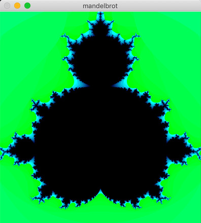

# Challenge 001 - Mandelbrot with OpenCV

Make a program which visualises Mandelbrot set with OpenCV

## Constraints

- Use C++11 style
- Customisable range of visualisation

## Prerequisites

C++11 compatible gcc compiler with OpenCV3 library.

## Build and run

```
$ ./make.sh
```

Then

```
$ build/mandelbrot
```





