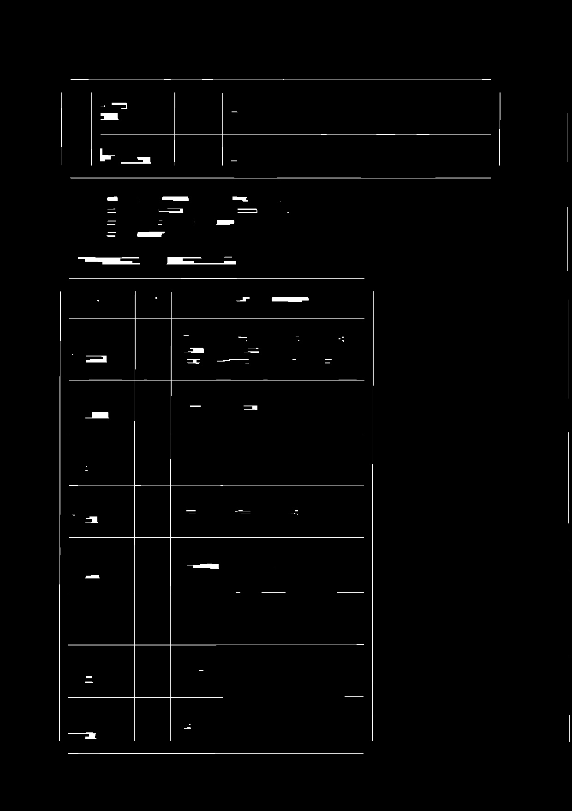
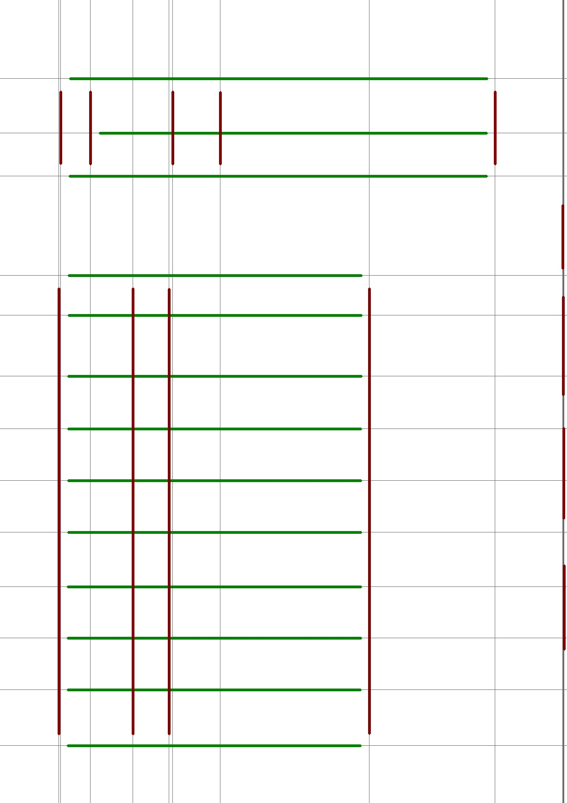
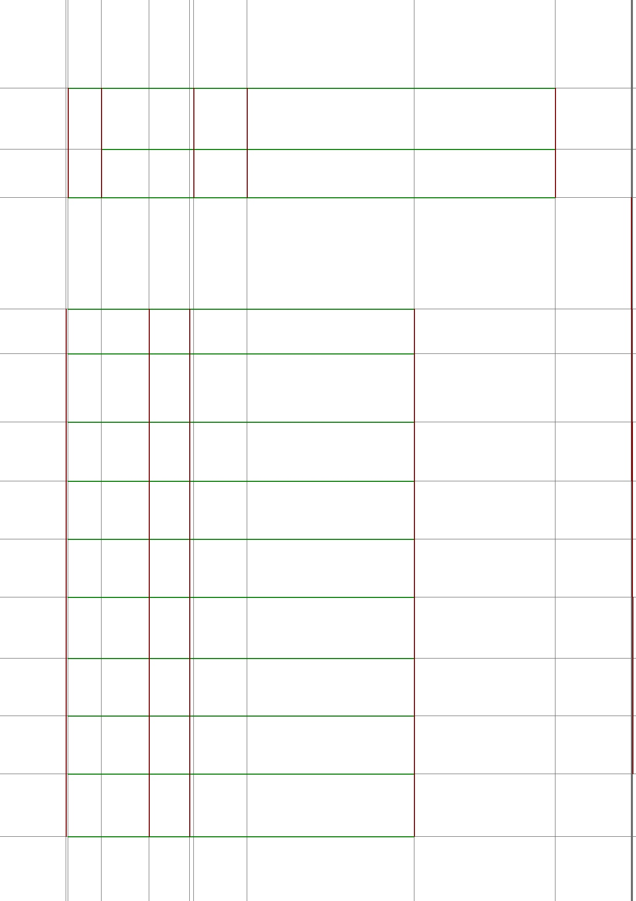
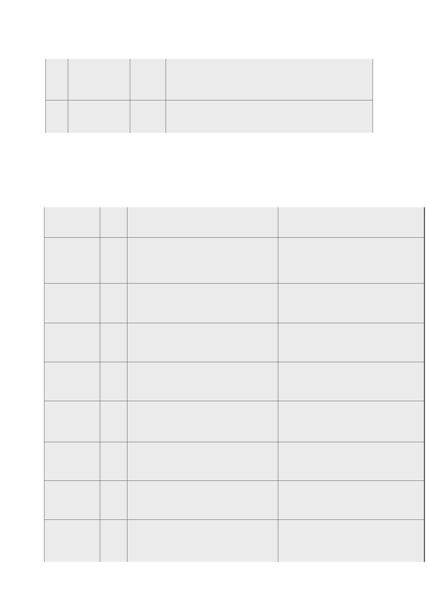

# Challenge 006 - Extract table info from image

Make a program which extracts table information from image

## Constraints

- Use C++11 style
- Get shape information of the table, rows, cols

## Prerequisites

C++11 compatible gcc compiler with OpenCV3 library.

## Build and run

```
$ ./make.sh
```

Then

```
$ bin/extract
```

## Outputs

Extracted line components from image 



Clean lines



Extended lines 



Reconstructed tables


