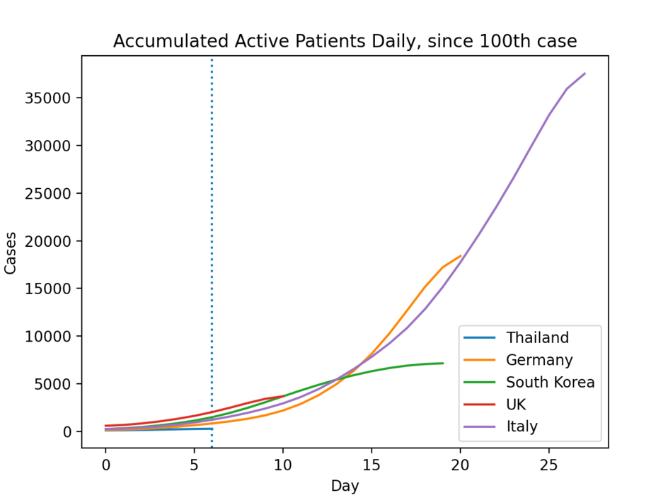
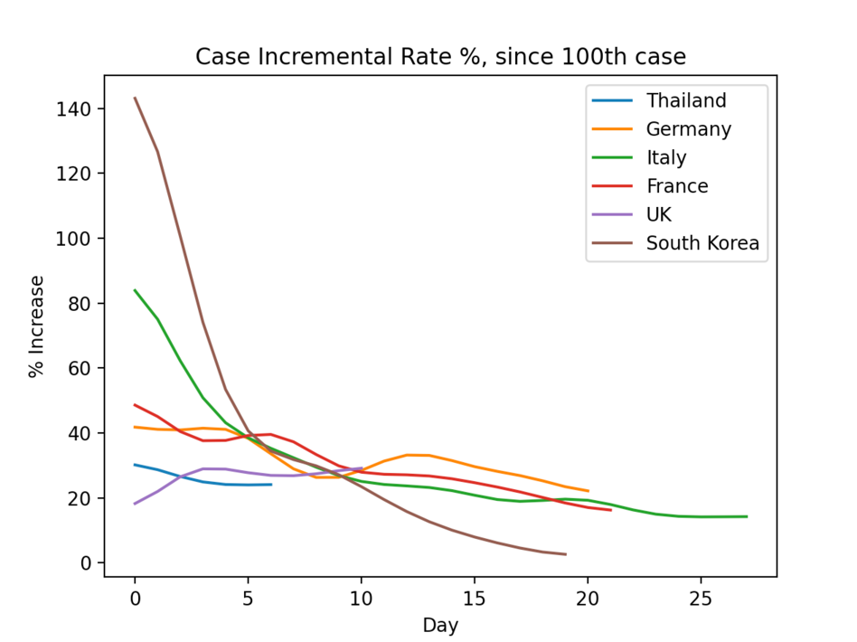
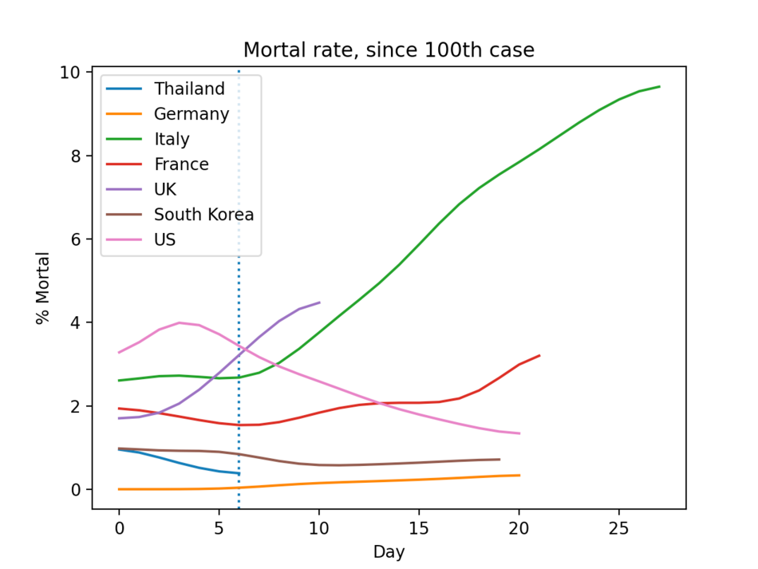
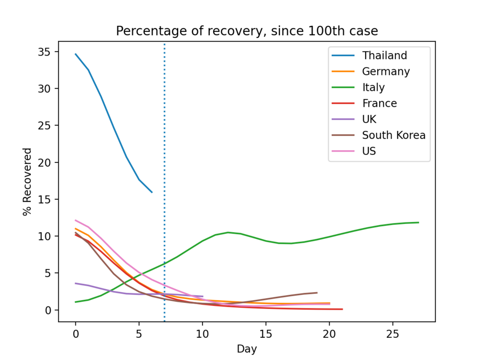
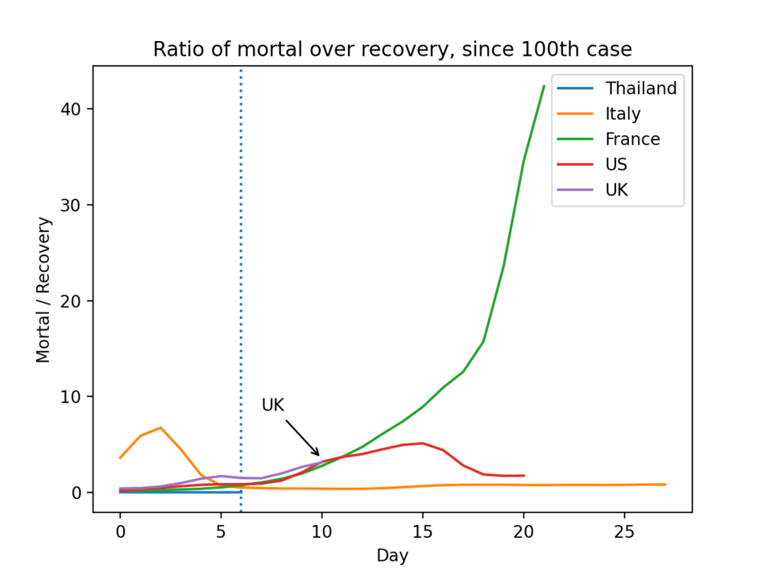

# 009 : Study COVID-19 data (playground)

Based on daily report data (https://github.com/CSSEGISandData/COVID-19)

## Prerequisites

First of all, create a new virtual environment and install python packages by:

```bash

$ virtualenv covid
$ source covid/bin/activate
$ pip3 install -r requirements.txt
```

Clone the Covid-19 daily case data repo somewhere

```bash
$ git clone https://github.com/CSSEGISandData/COVID-19.git
```

## Generate reports

Make sure you have the virtual env activated, then do following:

```bash

$ python3 -m covid19.plot {PATH_TO_COVID19_GIT_REPOPATH}
```

The program will show several plots

## Sample plots











## Licence

MIT

