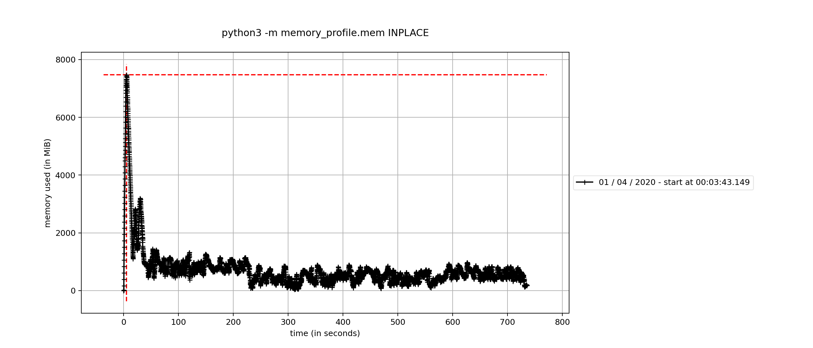
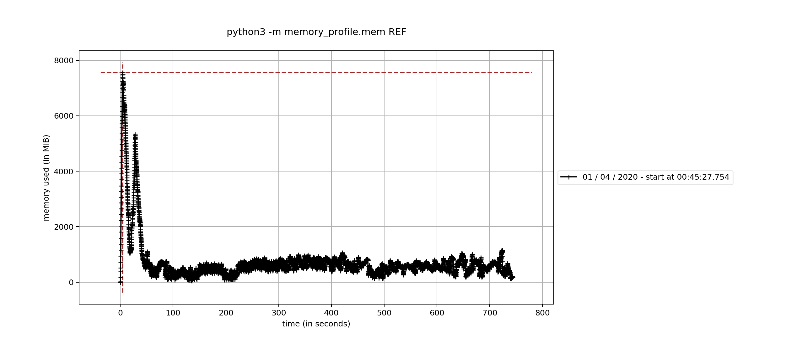
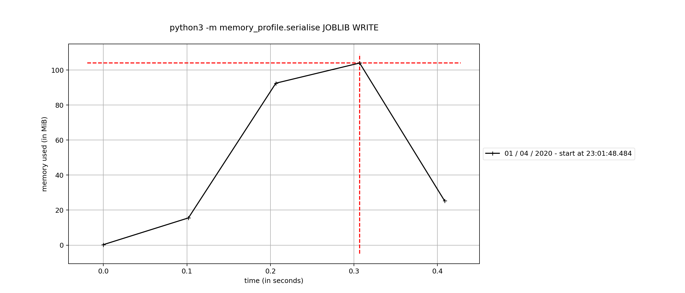
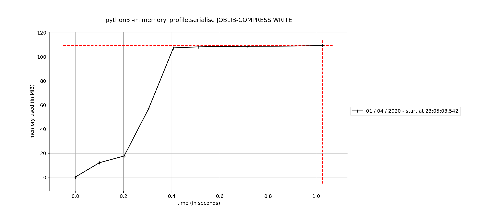
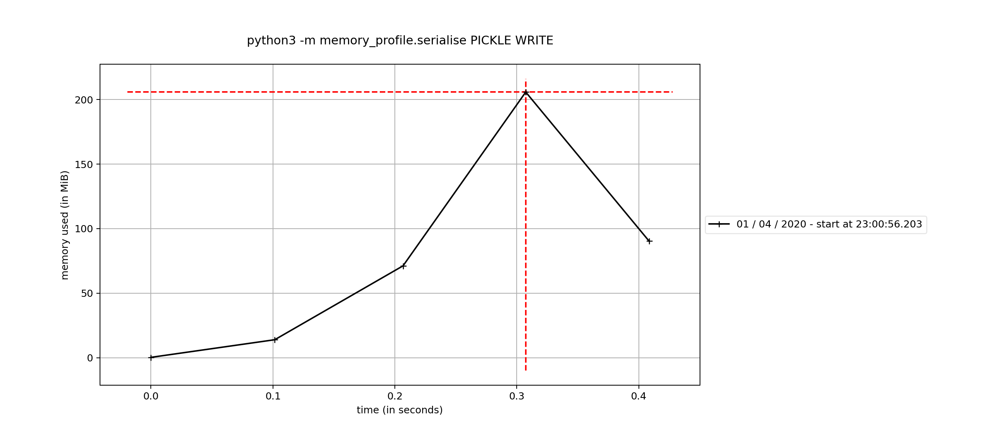
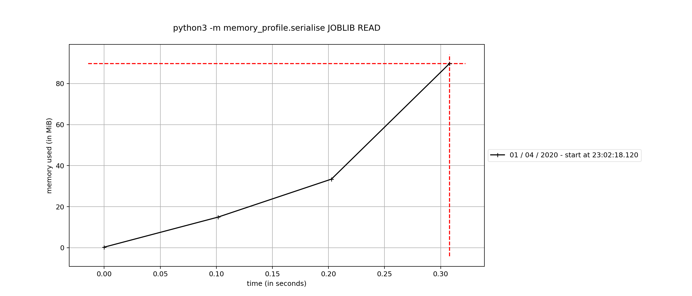
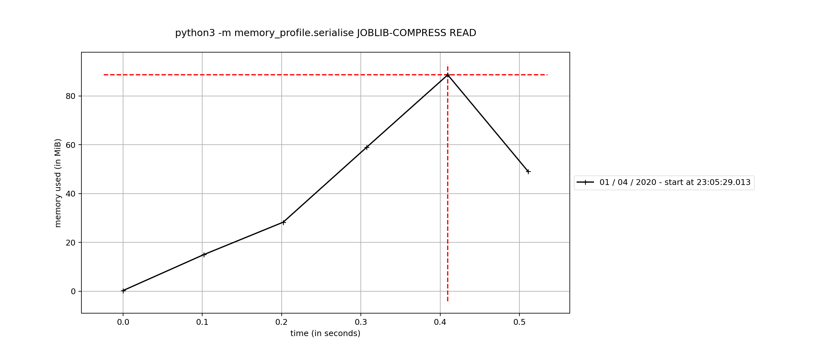
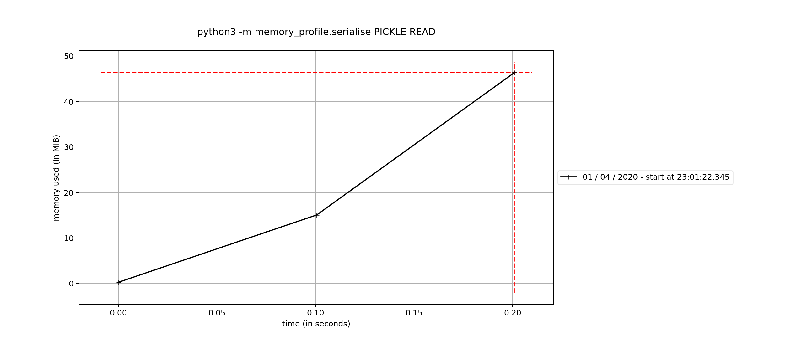

# Profiling Memory Access in Python 3.7

Run the preset profiling

```bash

$ mprof run python3 -m memory_profile.mem INPLACE
$ mprof run python3 -m memory_profile.mem NEW_ARRAY_SAME_REF

```

## Memory profiling





## Pickle vs Joblib

To run

```bash
$ mprof run python3 -m memory_profile.serialise JOBLIB WRITE
$ mprof run python3 -m memory_profile.serialise JOBLIB READ

$ mprof run python3 -m memory_profile.serialise JOBLIB-COMPRESS WRITE
$ mprof run python3 -m memory_profile.serialise JOBLIB-COMPRESS READ

$ mprof run python3 -m memory_profile.serialise PICKLE WRITE
$ mprof run python3 -m memory_profile.serialise PICKLE READ

```

Space usage

```
 76M  joblib
 15M  joblib-compressed
 76M  pickle
```

Writing memory & time comparison





Reading memory & time comparison






## Licence

MIT