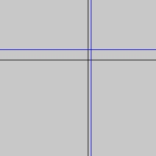
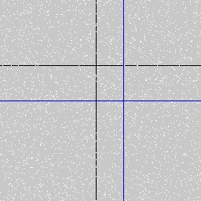
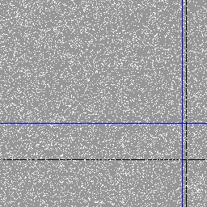
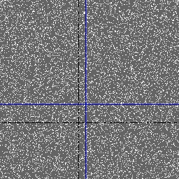
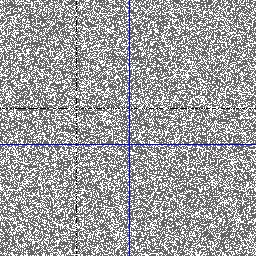

# Let TensorFlow estimate the crosshair coordinates in images

TBD

## Prerequisites

Prepare environment with `virtualenv`.

```bash
$ virtualenv env
$ source env/bin/activate
$ pip install -r requirements.txt
```

## Run

There are a few options you can run the tensor as follows.

### 1. Generate the training data

The repository has a script to generate the image data for you. 
You can either quickly run the following.

```bash
$ ./GEN_DATA
```

or generate data with your own desired parameters

```bash
$ python3 -m tensor.data --saveto {PATH} --size {NUM_FILES} --dim {IMAGE_WIDTH}
```

### 2. Train and validate the model

Running the following script to train the model

```bash
$ ./TRAIN
```

or train with your own desired parameters

```bash
$ python3 -m tensor.run --datapath {PATH} --ratio {TRAIN_RATIO} \
                        --batch {BATCHSIZE} --epoch {NUM_EPOCHS}
```

## Sample predictions

Following show graphical predictions of the model, not a bad model, isn't it?

> Blue lines denote predictions, whereas black lines represent labels

Without noise 




With moderate & heavy noise




## Model performance

The progress of the loss and error after each epoc is logged below.

```json
{
  "loss": [
    13603.977708604602,
    6835.145958794488,
    5439.133616129558,
    5065.907521565755,
    4794.051523844401
  ],
  "mae": [
    90.23223114013672,
    66.83195495605469,
    58.13719940185547,
    55.369441986083984,
    53.83049392700195
  ],
  "mse": [
    13603.974609375,
    6835.146484375,
    5439.13232421875,
    5065.90771484375,
    4794.05126953125
  ],
  "val_loss": [
    6321.635314941406,
    5382.705627441406,
    4565.4129638671875,
    4094.406494140625,
    4224.492340087891
  ],
  "val_mae": [
    65.3321304321289,
    56.06023406982422,
    50.06333541870117,
    46.57585906982422,
    47.33848571777344
  ],
  "val_mse": [
    6321.63623046875,
    5382.7060546875,
    4565.41259765625,
    4094.406494140625,
    4224.49267578125
  ]
}
```

Not a bad approach, of course not since the problem is relatively easy.

## Future work

MSE and MAE reflect the quality of the prediction so well in this problem. As shown above, trying more epochs may not push them any lower. Possibly considering a better structure of the CNN would help. I need to do more literature review in the field to gain some ideas.

## Licence

MIT