# Julia set with OpenCV

Visualise Julia set with OpenCV

### Prerequisites

C++17 compatible compiler (gcc preferred)

### Compile & Run

```
./make.sh
```

And run with

```
build/julia
```

### Sample sets

All following are rendered with `z_re` between [-1.5,+1.5] and `z_im` between [-1.5,+1.5], 
resolution of 0.001 and 50 iterations

```
c = -1
```

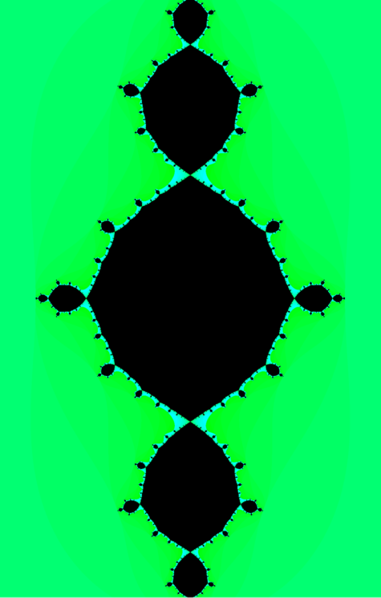


```
c = 0
```

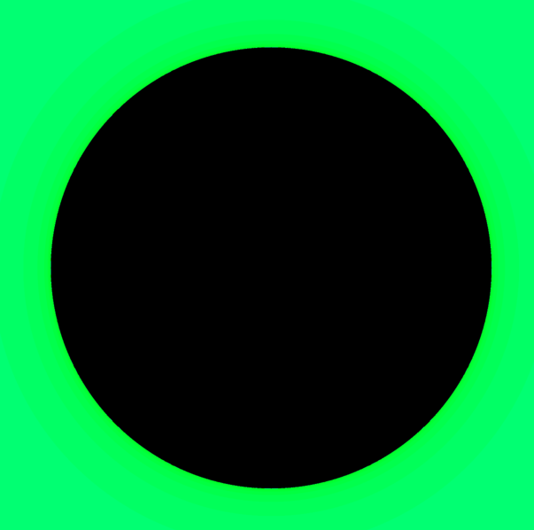


```
c = -i
```

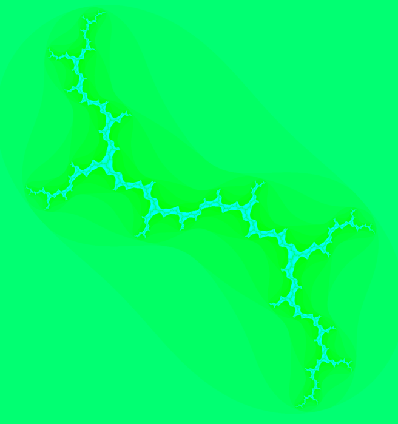


```
c = -0.123 + 0.745i
```

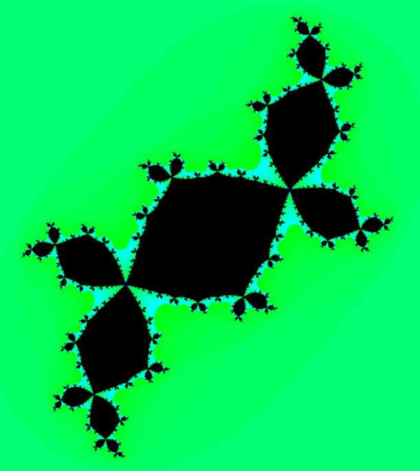


```
c = -0.75i
```

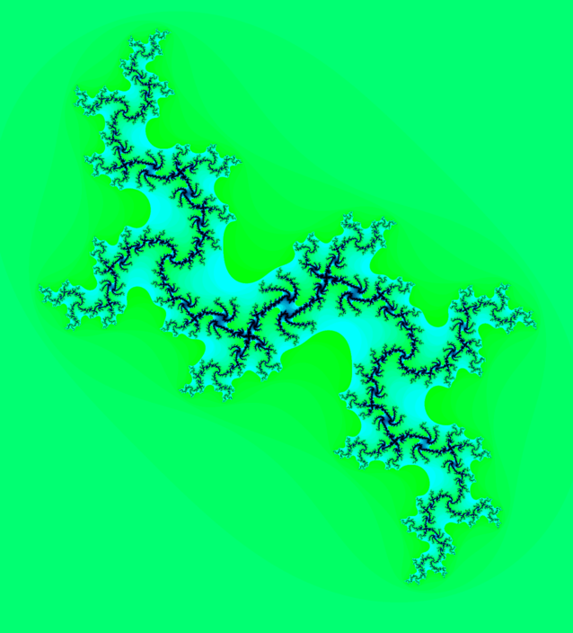


```
c = 0.285 + 0.01i
```

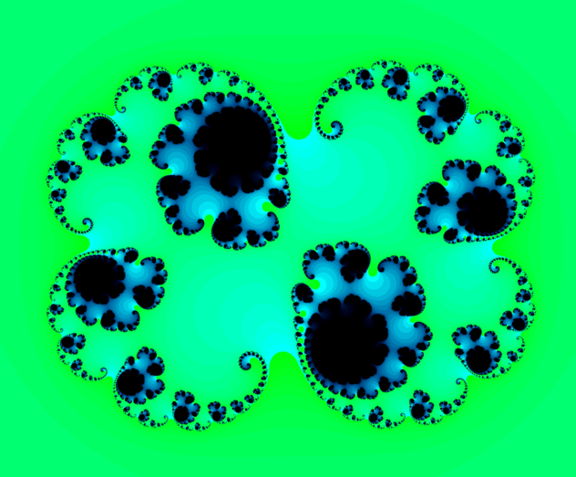


```
c = -0.4 + 0.6i
```

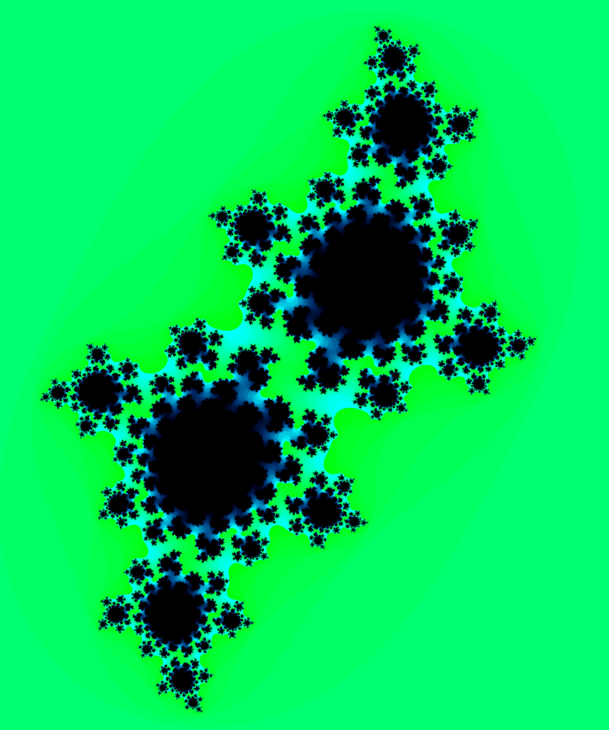


```
c = 0.285
```

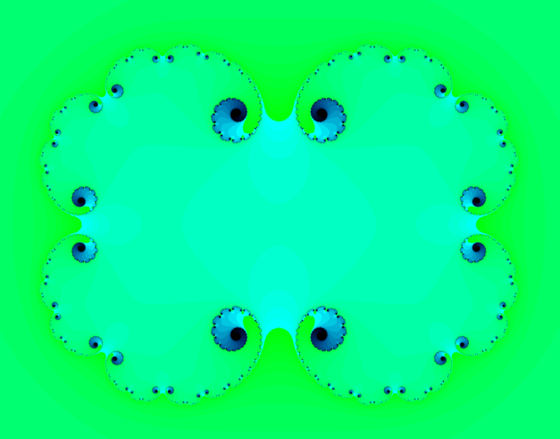


```
c = -0.70176 + -0.3842i
```

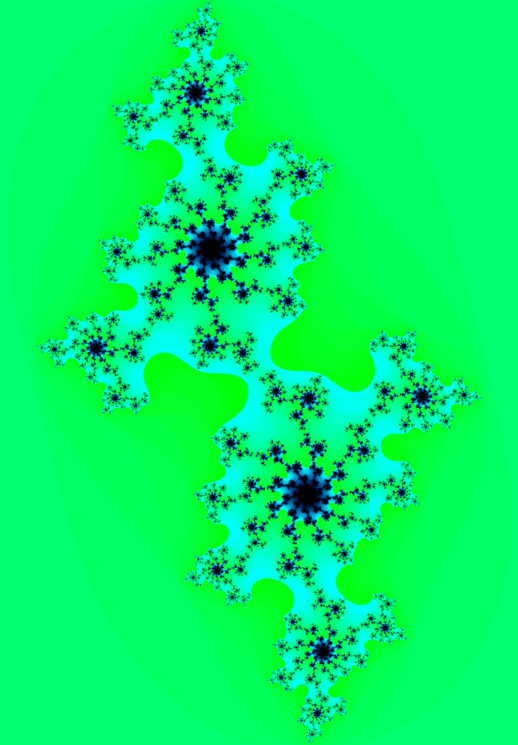


```
c = −0.835 − 0.2321i
```

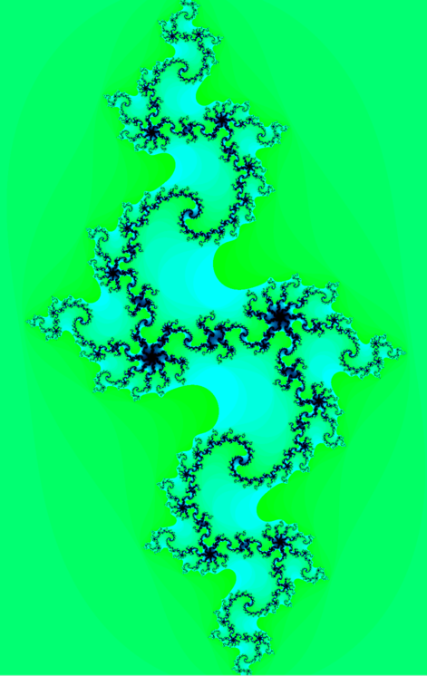

```
c = −0.7269 + 0.1889i

This one is rendered with iteration = 250
```

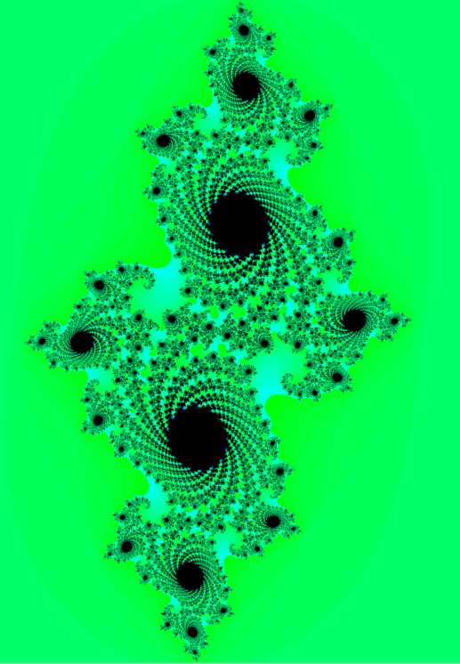

